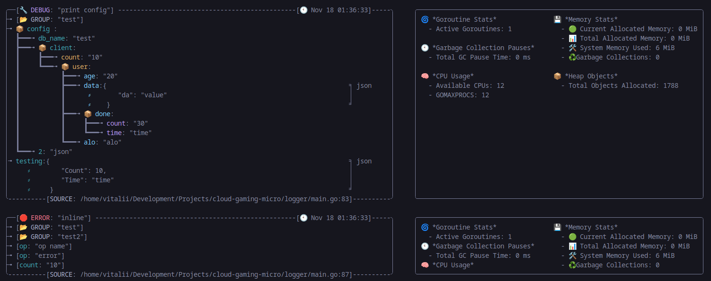

# Loggeer
A wrapper for the default `slog` logger.
It has a `pretty handler` that allows you to colorize your logs, and `discard handler` for mok logs.

## Logger setup:
```go 
func main() {
	log := logger.NewLogger(
		logger.WithLevel("debug"), logger.IsJSON(false),
		logger.WithSource(true), logger.IsPrettyOut(true))
}
```

## Example of data preparation:
```go
func (c *Config) LogValuer() logger.Value {
	return logger.GroupValue(
		logger.StringAttr("db_name", c.DbName),
		logger.Group("client",
			logger.IntAttr("count", c.Host.Count),
			logger.Group("user",
				logger.IntAttr("age", c.Host.User.Age),
				logger.AnyAttr("data", c.Host.User.Json),
				logger.Group("done"),
				logger.StringAttr("alo", c.Host.User.Alo),
			),
		),
		logger.StringAttr("2", "json"),
	)

}
```
## Logger call
```go
func main() {
	config := Config{DbName: "test",Host: Client{
			Count: 10,User: User{
				Age: 20,Alo: "alo",Json: map[string]interface{}{"da": "value"},
				Done: Done{Count: 30,Time:  "time"}},
			Json: map[string]interface{}{"avatr": "value"}}}

	log = log.WithGroup("test")

	log.Debug("print config", "config ", config.LogValuer(),logger.AnyAttr("testing",Done{Count:10, Time: "time"}))

	log = log.WithGroup("test2")
	log = log.With(logger.StringAttr("op", "op name"))
	log.Error("inline", logger.StringAttr("op", "error"), logger.IntAttr("count", 10))
}

```
## Stdout 

